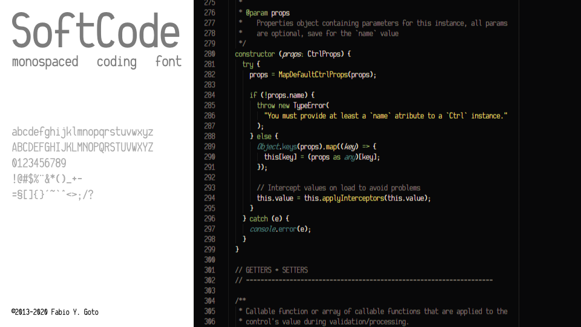

SoftCode
========

> A narrow monospaced font for coding, still vert WIP and not ready for regular use.

I'm not a pro graphic/type designer, so it might look messy and ugly while I learn the hangs of type design.

The project's glyphs were built in **Inkscape** then imported into **FontForge**. While I used auto-hinting because of laziness, some characters might have manual hinting to look better under small sizes.

You may see that the characters aren't perfectly grid-aligned on the SVG files, and that's to help with hinting them on small sizes too, and to avoid weird looking characters when exporting to OTF format specially.

# TODO

> Gotta review this list ASAP.

- [x] Base characters, rough version;
- [ ] Improve characters;
- [ ] Add more characters;
- [ ] Add bitmap characters for small sizes (maybe, if I don't get hinting right);
- [ ] More languages support (who knows?);

# Author

**Fabio Y. Goto** ([lab@yuiti.com.br][0])

# License

This project is licensed under the `MIT License`. Please check the `LICENSE.md` file for details.

-----

_©2013-2020 Fabio Y. Goto_

[0]: mailto:lab@yuiti.com.br
